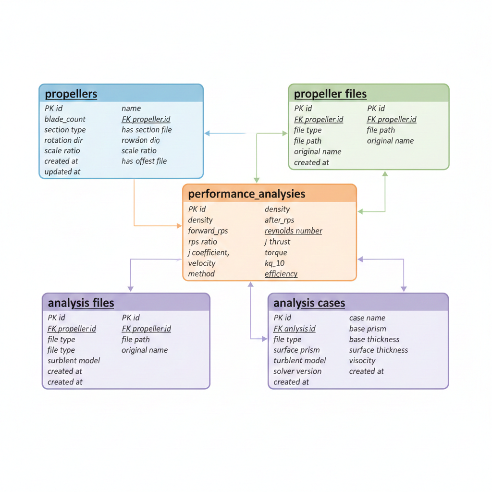

# E-CRP DB Frame 스키마 설계

## 1. ERD (Entity Relationship Diagram)



---

## 2. 테이블 상세 설계

### 2.1 propellers (프로펠러 기본 정보)

| 컬럼명 | 데이터 타입 | 제약조건 | 설명 |
|--------|-----------|----------|------|
| id | SERIAL | PK | 고유 식별자 |
| name | VARCHAR(100) | NOT NULL, UNIQUE | 프로펠러 이름 (예: KP1711) |
| blade_count | INTEGER | NOT NULL | 날개수 |
| section_type | VARCHAR(50) | NOT NULL | 사용단면 (예: NACA 66 mod) |
| has_section_file | BOOLEAN | DEFAULT false | 사용단면 파일 유무 |
| rotation_direction | VARCHAR(10) | NOT NULL | 회전방향 (RIGHT/LEFT) |
| power_ratio | VARCHAR(10) | NOT NULL | Power Ratio (예: 5:5, 4:6) |
| scale_ratio | DECIMAL(10,4) | NOT NULL | 스케일 비율 |
| has_offset_file | BOOLEAN | DEFAULT false | Offset 파일 유무 |
| created_at | TIMESTAMP | DEFAULT NOW() | 생성일시 |
| updated_at | TIMESTAMP | DEFAULT NOW() | 수정일시 |

### 2.2 propeller_files (프로펠러 파일)

| 컬럼명 | 데이터 타입 | 제약조건 | 설명 |
|--------|-----------|----------|------|
| id | SERIAL | PK | 고유 식별자 |
| propeller_id | INTEGER | FK, NOT NULL | 프로펠러 참조 |
| file_type | VARCHAR(30) | NOT NULL | 파일 유형 |
| file_path | VARCHAR(500) | NOT NULL | 저장 경로 |
| original_name | VARCHAR(255) | NOT NULL | 원본 파일명 |
| file_size | BIGINT | | 파일 크기 (bytes) |
| created_at | TIMESTAMP | DEFAULT NOW() | 업로드일시 |

**file_type ENUM 값:**
- `OFFSET` - Offset 파일 (.dat)
- `SECTION` - 사용단면 파일 (.blk)
- `IMAGE_TOP` - 형상 사진 (top)
- `IMAGE_FRONT` - 형상 사진 (front)
- `IMAGE_SIDE` - 형상 사진 (side)
- `DRAWING` - 제작도면 파일
- `GEOMETRY_DATA` - Propeller Geometry Data (.out)
- `GEOMETRY_INFO` - 형상 정보 파일 (.csv)
- `CAD_IGS` - 형상 파일 (.igs)
- `CAD_STL` - 형상 파일 (.stl)
- `CAD_STP` - 형상 파일 (.stp)

### 2.3 performance_analyses (성능해석)

| 컬럼명 | 데이터 타입 | 제약조건 | 설명 |
|--------|-----------|----------|------|
| id | SERIAL | PK | 고유 식별자 |
| propeller_id | INTEGER | FK, NOT NULL | 프로펠러 참조 |
| density | DECIMAL(12,6) | NOT NULL | 밀도 |
| viscosity | DECIMAL(12,8) | NOT NULL | 점성 계수 |
| after_rps | DECIMAL(10,4) | NOT NULL | 후방 RPS |
| forward_rps | DECIMAL(10,4) | NOT NULL | 전방 RPS |
| rps_ratio | DECIMAL(6,4) | | 계산값: after_rps / forward_rps |
| reynolds_number | DECIMAL(15,8) | | 레이놀즈 수 |
| j_coefficient | DECIMAL(6,4) | NOT NULL | 전진계수 (J) |
| velocity | DECIMAL(12,6) | | 계산값: J × Forward RPS × Forward Diameter |
| thrust | DECIMAL(12,4) | | 추력 (Output) |
| torque | DECIMAL(12,4) | | 토크 (Output) |
| kt | DECIMAL(8,6) | | 추력 계수 (Output) |
| kq_10 | DECIMAL(8,6) | | 토크 계수 ×10 (Output) |
| efficiency | DECIMAL(8,6) | | 효율 ηO (Output) |
| method | VARCHAR(50) | | 해석 방법 (RANS/URANS/LES) |
| created_at | TIMESTAMP | DEFAULT NOW() | 생성일시 |

### 2.4 analysis_files (해석 결과 파일)

| 컬럼명 | 데이터 타입 | 제약조건 | 설명 |
|--------|-----------|----------|------|
| id | SERIAL | PK | 고유 식별자 |
| analysis_id | INTEGER | FK, NOT NULL | 성능해석 참조 |
| file_type | VARCHAR(30) | NOT NULL | 파일 유형 |
| file_path | VARCHAR(500) | NOT NULL | 저장 경로 |
| original_name | VARCHAR(255) | NOT NULL | 원본 파일명 |
| file_size | BIGINT | | 파일 크기 (bytes) |
| created_at | TIMESTAMP | DEFAULT NOW() | 업로드일시 |

**file_type ENUM 값:**
- `PRESSURE` - 해석결과 (Pressure)
- `WAKE` - 해석결과 (Wake)
- `GRAPH_TURBULENT` - Turbulent Graph
- `GRAPH_FORCE` - Rotating propeller force Graph

### 2.5 analysis_cases (해석 케이스)

| 컬럼명 | 데이터 타입 | 제약조건 | 설명 |
|--------|-----------|----------|------|
| id | SERIAL | PK | 고유 식별자 |
| analysis_id | INTEGER | FK, NOT NULL | 성능해석 참조 |
| case_name | VARCHAR(100) | NOT NULL | 케이스명 (예: R-K-E_J0.2~0.9) |
| base_prism | INTEGER | | Default Control - Number Prism |
| base_thickness | DECIMAL(6,4) | | Default Control - Total Thickness |
| surface_prism | INTEGER | | Surface Control - Number Prism |
| surface_thickness | DECIMAL(6,4) | | Surface Control - Total Thickness |
| turbulent_model | VARCHAR(30) | | 난류 모델 (Lag-K-E 등) |
| viscosity | DECIMAL(12,8) | | 점성 계수 |
| solver_version | VARCHAR(50) | | 솔버 버전 (STAR-CCM+ ver) |
| created_at | TIMESTAMP | DEFAULT NOW() | 생성일시 |

### 2.6 efd_cfd_comparisons (EFD vs CFD 비교)

| 컬럼명 | 데이터 타입 | 제약조건 | 설명 |
|--------|-----------|----------|------|
| id | SERIAL | PK | 고유 식별자 |
| analysis_id | INTEGER | FK, NOT NULL | 성능해석 참조 |
| j_value | DECIMAL(6,4) | NOT NULL | J 값 |
| efd_kt | DECIMAL(8,6) | | EFD KT |
| efd_kq_10 | DECIMAL(8,6) | | EFD 10KQ |
| efd_eta | DECIMAL(8,6) | | EFD ETAO |
| cfd_kt | DECIMAL(8,6) | | CFD KT |
| cfd_kq_10 | DECIMAL(8,6) | | CFD 10KQ |
| cfd_eta | DECIMAL(8,6) | | CFD ETAO |
| kt_diff_percent | DECIMAL(8,4) | | KT 차이율(%) |
| kq_diff_percent | DECIMAL(8,4) | | 10KQ 차이율(%) |
| eta_diff_percent | DECIMAL(8,4) | | ETAO 차이율(%) |
| created_at | TIMESTAMP | DEFAULT NOW() | 생성일시 |

---

## 3. 인덱스 설계

| 테이블 | 인덱스명 | 컬럼 | 타입 |
|--------|---------|------|------|
| propellers | idx_propellers_name | name | UNIQUE |
| propeller_files | idx_propeller_files_pid | propeller_id | BTREE |
| propeller_files | idx_propeller_files_type | file_type | BTREE |
| performance_analyses | idx_analyses_pid | propeller_id | BTREE |
| performance_analyses | idx_analyses_j | j_coefficient | BTREE |
| analysis_files | idx_analysis_files_aid | analysis_id | BTREE |
| analysis_cases | idx_cases_aid | analysis_id | BTREE |
| efd_cfd_comparisons | idx_comparisons_aid | analysis_id | BTREE |

---

## 4. 제약조건

### 4.1 CHECK 제약조건

```sql
-- propellers
CHECK (blade_count > 0)
CHECK (rotation_direction IN ('RIGHT', 'LEFT'))
CHECK (scale_ratio > 0)

-- performance_analyses
CHECK (density > 0)
CHECK (viscosity > 0)
CHECK (after_rps > 0)
CHECK (forward_rps > 0)
CHECK (j_coefficient >= 0)
```

### 4.2 외래키 제약조건

- `propeller_files.propeller_id` → `propellers.id` (ON DELETE CASCADE)
- `performance_analyses.propeller_id` → `propellers.id` (ON DELETE CASCADE)
- `analysis_files.analysis_id` → `performance_analyses.id` (ON DELETE CASCADE)
- `analysis_cases.analysis_id` → `performance_analyses.id` (ON DELETE CASCADE)
- `efd_cfd_comparisons.analysis_id` → `performance_analyses.id` (ON DELETE CASCADE)

---

*문서 작성일: 2025-12-30*
*버전: 1.0*
