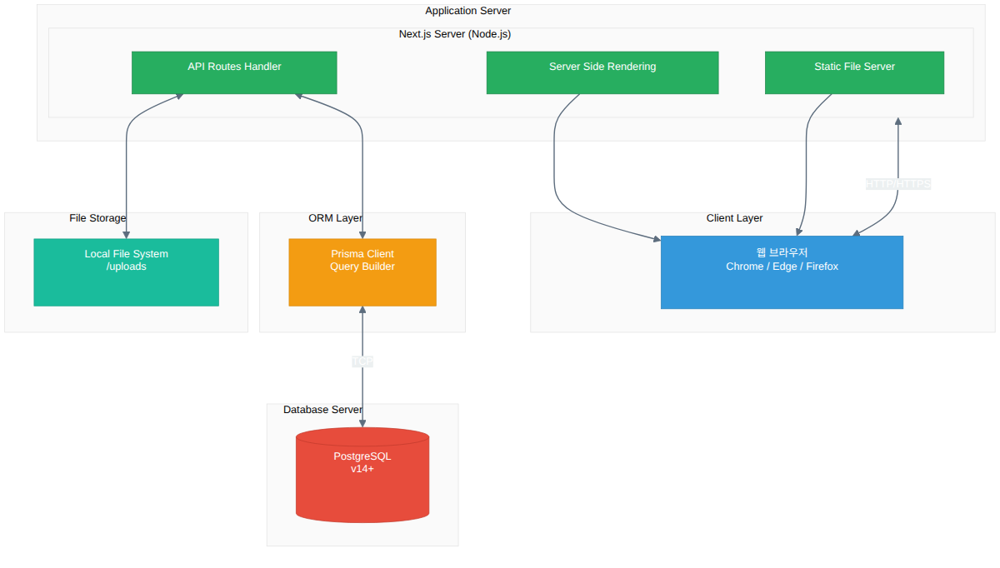

# E-CRP DB Frame 설계 문서

---

## Part 1. 기능명세서

---

## 1. 개요

### 1.1 시스템 목적
CRP(Contra-Rotating Propeller) 계열화 데이터 관리를 위한 데이터베이스 관리 시스템 구축

### 1.2 주요 목표
- CRP 계열화 데이터 관리를 위한 데이터베이스 관리 도구 선정
- CRP 운용조건, 해석방법(포텐셜, CFD), 해석조건 등에 따른 분류 항목 선정
- DB 분류 항목별 가시성 확보를 위한 화면 구축

### 1.3 결과리포트 (CFD DB Record)

CFD 해석 결과를 기록하고 EFD(실험) 데이터와 비교 분석한 내용 출력

#### 1.3.1 CFD DB Record 예시

**Case 1 : R-K-E_J0.2~0.9**
| Propeller | 성능해석방법 | Density | Viscosity | Reynold Number | RPS   |         | RPS Ratio |
| --------- | ------ | ------- | --------- | -------------- | ----- | ------- | --------- |
|           |        |         |           |                | After | Forward |           |
| KP1711    | CFD    | 998.05  | 0.00015   | 5.0E-6         | 20    | 16      | 1.25      |

| Method             | Setting Value  | Program Ver.    | 해석 파일명              | 해석결과                    |
| ------------------ | -------------- | --------------- | ------------------- | ----------------------- |
| RANS / URANS / LES | KP1711_set.txt | STAR-CCM+ 16.06 | CRP_J0.2_rps3@20000 | Pressure / Wake / Graph |

| EFD   |        |          |          |     | EFD vs CFD1(Ref.) |         |            |          |             |            |          |             |          |             |
| ----- | ------ | -------- | -------- | --- | ----------------- | ------- | ---------- | -------- | ----------- | ---------- | -------- | ----------- | -------- | ----------- |
| **J** | **KT** | **10KQ** | **ETAO** |     | **J**             | **Vin** | **THRUST** | **KT**   | **Diff(%)** | **TORQUE** | **10KQ** | **Diff(%)** | **ETAO** | **Diff(%)** |
| 0.2   | 0.4536 | 0.662    | 0.218    |     | 0.2               | 0.8     | 436.768    | 0.437425 | -3.57%      | 15.6413    | 0.62692  | -5.30%      | 0.222213 | 1.93%       |
| 0.3   | 0.4004 | 0.5943   | 0.322    |     | 0.3               | 1.2     | 387.468    | 0.38805  | -3.08%      | 14.1591    | 0.567215 | -4.56%      | 0.326649 | 1.44%       |
| 0.4   | 0.3452 | 0.5252   | 0.418    |     | 0.4               | 1.6     | 336.292    | 0.336797 | -2.43%      | 12.634     | 0.506119 | -3.63%      | 0.423639 | 1.35%       |
| 0.5   | 0.2903 | 0.457    | 0.506    |     | 0.5               | 2       | 284.369    | 0.284796 | -1.90%      | 11.0866    | 0.444413 | -2.82%      | 0.510386 | 0.85%       |
| 0.6   | 0.2369 | 0.3905   | 0.579    |     | 0.6               | 2.4     | 231.848    | 0.232196 | -1.98%      | 9.50042    | 0.380588 | -2.54%      | 0.582601 | 0.62%       |
| 0.7   | 0.1848 | 0.3245   | 0.634    |     | 0.7               | 2.8     | 179.708    | 0.179978 | -2.61%      | 7.87558    | 0.315496 | -2.77%      | 0.635541 | 0.24%       |
| 0.8   | 0.1323 | 0.2559   | 0.658    |     | 0.8               | 3.2     | 127.513    | 0.127705 | -3.47%      | 6.18459    | 0.247755 | -3.18%      | 0.65629  | -0.26%      |
| 0.9   | 0.0767 | 0.1798   | 0.611    |     | 0.9               | 3.6     | 73.9846    | 0.074206 | -3.40%      | 4.34681    | 0.174133 | -3.15%      | 0.6095   | -0.25%      |

> 실험 값을 기준으로 CFD1(Ref.)의 KT, KQ는 낮게 추정되며 편차가 낮은 0.2에서 최대 5.35% 낮은 결과를 보임

### 1.4 서비스 구성도


---

## 2. 기능 요구사항

### 2.1 프로펠러 설계 및 모델링 DB 관리

#### 2.1.1 유저 직접입력 항목

| 항목명          | 데이터 타입          | 예시          | 설명              |
| ------------ | --------------- | ----------- | --------------- |
| 프로펠러 이름      | String          | KP1711      | 프로펠러 식별자        |
| 날개수          | Value (Integer) | 4           | 프로펠러 날개 개수      |
| 사용단면         | String          | NACA 66 mod | 프로펠러 단면 형상      |
| 사용단면 파일 유무   | String          | O, X        | 단면 파일 존재 여부     |
| 회전방향         | String          | Right, Left | 프로펠러 회전 방향      |
| Power Ratio  | String          | 5:5, 4:6    | 전후 프로펠러 출력 비율   |
| 스케일 비율       | Value (Float)   | 42.063      | 모델 스케일 비율       |
| Offset 파일 유무 | String          | O, X        | Offset 파일 존재 여부 |
| 프로펠러 직경      | Value           | 0.25 m      | 프로펠러 직경         |
| 반경 방향 개수     | Value           | 11 ea       | r/R 개수          |
| Hub Ratio    | Value           | 0.2         | 프로펠러 직경 대비 허브 비 |
| 확장 면적비       | Value           | 0.561       | 프로펠러 날개 면적 비율   |

#### 2.1.2 파일 업로드 항목 (총 7개)

| 파일 종류 | 확장자 | 호환 형식 | 설명 |
|----------|--------|----------|------|
| Offset 파일 | .dat | .txt 호환 | 프로펠러 오프셋 데이터 |
| 사용단면 파일 | .blk | .txt 호환 | 단면 형상 데이터 |
| 형상 사진 | .jpg | - | Top, Front, Side 뷰 이미지 |
| 제작도면 파일 | .jpg | - | 프로펠러 제작 도면 |
| Propeller Geometry Data | .out | .txt 호환 | 프로펠러 형상 데이터 |
| 형상 정보 파일 | .csv | - | 형상 정보 스프레드시트 |
| 형상 파일 | .igs, .stl, .stp | - | 3D CAD 형상 파일 |

---

### 2.2 성능해석 DB 관리

#### 2.2.1 유저 직접입력 항목 - Input

| 항목명                     | 데이터 타입        | 예시                    | 계산식/설명                                    |
| ----------------------- | ------------- | --------------------- | ----------------------------------------- |
| Analysis Method         | Value (Float) | EFD / CFD / Potential | 성능해석 방식 설정                                |
| Density                 | Value (Float) | 998.05                | 유체 밀도                                     |
| Viscosity               | Value (Float) | 0.00015               | 동점성 계수                                    |
| After RPS               | Value (Float) | 15                    | 후방 프로펠러 회전수                               |
| Forward RPS             | Value (Float) | 20                    | 전방 프로펠러 회전수                               |
| RPS Ratio               | Value (Float) | 0.75                  | After RPS / Forward RPS                   |
| Reynolds Number         | Value (Float) | 0.000011              | Density × Velocity × Diameter / Viscosity |
| J (Advance Coefficient) | Value (Float) | 0.2                   | 전진계수                                      |
| Velocity                | Value (Float) | 0.062                 | J × Forward RPS × Forward Diameter        |

#### 2.2.2 유저 직접입력 항목 - Output

| 항목명 | 데이터 타입 | 예시 | 설명 |
|--------|-----------|------|------|
| Thrust | Value (Float) | 120.12 | 추력 |
| Torque | Value (Float) | 6.83 | 토크 |
| KT | Value (Float) | 0.9275 | 추력 계수 |
| 10KQ | Value (Float) | 1.7802 | 토크 계수 (×10) |
| ηO | Value (Float) | 0.1659 | 프로펠러 효율 |
| Method | String | Lag K-e, K-w | 해석 방법 (RANS/URANS/LES) |

#### 2.2.3 파일 업로드 항목 (총 4개)

| 파일 종류 | 확장자 | 설명 |
|----------|--------|------|
| 해석결과 (Pressure) | .png | 압력 분포 시각화 이미지 |
| 해석결과 (Wake) | .png | 유동장(Wake) 시각화 이미지 |
| 해석결과 (Graph) | .png | 성능 그래프 이미지 (Turbulent Graph, Force Graph 등) |

---

## 3. 화면 구성 요구사항

### 3.1 메인 화면 구성요소

1. **SQL 프로그래밍 (DB 논리모델)**: 데이터베이스 구조 관리
2. **DB Case Table**: 프로펠러 케이스별 데이터 테이블 뷰
3. **DB Record** : 성능해석 결과 기록 관리
4. **DB Analytics**: 성능해석 분석 및 시각화

### 3.2 시각화 요소

- Blade Mesh 시각화
- Pressure 분포 시각화 (J 값별)
- Turbulent Graph
- Rotating propeller force Graph

---

## 4. 데이터 분류 체계

### 4.1 분류 기준
- **운용조건**: 운용 환경 및 조건별 분류
- **해석방법**: 포텐셜 해석, CFD 해석
- **해석조건**: Method, Setting Value File, Program ver., 파일명, 해석결과 등

### 4.2 Case 관리 구조
#### 공통항목

| 항목명             | 데이터 타입        | 예시                    |         |
| --------------- | ------------- | --------------------- | ------- |
| Propeller       | String        | KP1711                |         |
| Analysis Method | String        | EFD / CFD / Potential |         |
| Density         | Value (Float) | 998.05                |         |
| Viscosity       | Value (Float) | 0.00015               |         |
| Reynold Number  | Value (Float) | 5.0E-6                |         |
| RPS             | Value (Float) | After                 | Forward |
|                 |               | 20                    | 16      |
| RPS Ratio       | Value (Float) | 1.25                  |         |

#### 성능해석 방법에 따른 추가항목 (CFD)

| 항목명           | 데이터 타입 | 확장자  | 예시                      |
| ------------- | ------ | ---- | ----------------------- |
| Method        | String |      | RANS / URANS / LES      |
| Setting Value |        | .txt | KP1711_Set              |
| Program Ver.  | String |      | STAR-CCM+ 16.06         |
| 해석 파일명        | String |      | CRP_J0.2_rps3@20000     |
| 해석결과          |        | .png | Pressure / Wake / Graph |

#### 성능해석 방법에 따른 추가항목 (Potential)

| 항목명     | 데이터 타입 | 확장자 | 예시                       |
| ------- | ------ | --- | ------------------------ |
| Program | String |     | 인하대 코드                   |
| 해석 파일명  | String |     | CRP_J0.2_Potiantial_Inha |


---

## 5. 데이터 검증 요구사항

### 5.1 EFD vs CFD 비교
- KT, 10KQ, ETAO 값의 EFD (실험) 대비 성능해석 차이율 (%) 계산
- 기준값 대비 오차 범위 검증

### 5.2 계산값 자동 산출
- RPS Ratio = After RPS / Forward RPS
- Reynolds Number = Density × Velocity × Diameter / Viscosity
- Velocity = J × Forward RPS × Forward Diameter

---

## 6. 기술 스택 (권장)

| 구분 | 기술 |
|------|------|
| Database | PostgreSQL |
| Backend | NextJS |
| Frontend | NextJS |
| 파일 저장 | Object Storage |

---

## 7. 부록

### 7.1 파일 형식 상세

#### Offset 파일 (.dat) 구조 예시
```
CRP_After_2009
4  1  11  0
42.063790.000  0.200  0.699  1.078
160.000158.000158.000  20.000  57.500  75.000
0.200  0.250  0.300  0.400  0.500  0.600  0.700  0.800  0.900  0.950  1.000
...
```

#### 사용단면 파일 (.blk) 구조 예시
```
Number of Total Section Profile(1999. 09. 20)
1
C= IsecT=0 ============================== 1997. 05. 00 =====C
NACA66
Comment | NACA66 Thickness+a=0.8 Meanline Camber modified T.E. at KRISO
DATA XL_G
0.0000 0.0100 0.0250 0.0500 0.1000 0.2000 0.3000 0.4000 0.4500
...
```

---

## Part 2. DB 스키마 설계

---

## 8. ERD (Entity Relationship Diagram)


---

## 9. 테이블 상세 설계

### 9.1 propellers (프로펠러 기본 정보)

| 컬럼명                | 데이터 타입         | 제약조건             | 설명                              |
| ------------------ | -------------- | ---------------- | ------------------------------- |
| id                 | SERIAL         | PK               | 고유 식별자                          |
| name               | VARCHAR(100)   | NOT NULL, UNIQUE | 프로펠러 이름 (예: KP1711)             |
| blade_count        | INTEGER        | NOT NULL         | 날개수                             |
| section_type       | VARCHAR(50)    | NOT NULL         | 사용단면 (예: NACA 66 mod)           |
| has_section_file   | BOOLEAN        | DEFAULT false    | 사용단면 파일 유무                      |
| rotation_direction | VARCHAR(10)    | NOT NULL         | 회전방향 (RIGHT/LEFT)               |
| power_ratio        | VARCHAR(10)    | NOT NULL         | Power Ratio (예: 5:5, 4:6)       |
| scale_ratio        | DECIMAL(10,4)  | NOT NULL         | 스케일 비율                          |
| has_offset_file    | BOOLEAN        | DEFAULT false    | Offset 파일 유무                    |
| created_at         | TIMESTAMP      | DEFAULT NOW()    | 생성일시                            |
| updated_at         | TIMESTAMP      | DEFAULT NOW()    | 수정일시                            |
| propeller_dia.     | DECIMAL(10, 4) | NOT NULL         | 프로펠러 직경 (단위: m, 예: 0.25)        |
| num_section        | INTEGER        | NOT NULL         | 반경 방향 개수 (r/R 개수, 예: 11)        |
| hub_ratio          | DECIMAL(10, 4) | NOT NULL         | Hub Ratio (직경 대비 허브 비율, 예: 0.2) |
| ae_a0              | DECIMAL(10, 4) | NOT NULL         | 확장 면적비 (Ae/A0, 예: 0.561)        |

### 9.2 propeller_files (프로펠러 파일)

| 컬럼명 | 데이터 타입 | 제약조건 | 설명 |
|--------|-----------|----------|------|
| id | SERIAL | PK | 고유 식별자 |
| propeller_id | INTEGER | FK, NOT NULL | 프로펠러 참조 |
| file_type | VARCHAR(30) | NOT NULL | 파일 유형 |
| file_path | VARCHAR(500) | NOT NULL | 저장 경로 |
| original_name | VARCHAR(255) | NOT NULL | 원본 파일명 |
| file_size | BIGINT | | 파일 크기 (bytes) |
| created_at | TIMESTAMP | DEFAULT NOW() | 업로드일시 |

**file_type ENUM 값:**
- `OFFSET` - Offset 파일 (.dat)
- `SECTION` - 사용단면 파일 (.blk)
- `IMAGE_TOP` - 형상 사진 (top)
- `IMAGE_FRONT` - 형상 사진 (front)
- `IMAGE_SIDE` - 형상 사진 (side)
- `DRAWING` - 제작도면 파일
- `GEOMETRY_DATA` - Propeller Geometry Data (.out)
- `GEOMETRY_INFO` - 형상 정보 파일 (.csv)
- `CAD_IGS` - 형상 파일 (.igs)
- `CAD_STL` - 형상 파일 (.stl)
- `CAD_STP` - 형상 파일 (.stp)

### 9.3 performance_analyses (성능해석)

| 컬럼명 | 데이터 타입 | 제약조건 | 설명 |
|--------|-----------|----------|------|
| id | SERIAL | PK | 고유 식별자 |
| propeller_id | INTEGER | FK, NOT NULL | 프로펠러 참조 |
| density | DECIMAL(12,6) | NOT NULL | 밀도 |
| viscosity | DECIMAL(12,8) | NOT NULL | 점성 계수 |
| after_rps | DECIMAL(10,4) | NOT NULL | 후방 RPS |
| forward_rps | DECIMAL(10,4) | NOT NULL | 전방 RPS |
| rps_ratio | DECIMAL(6,4) | | 계산값: after_rps / forward_rps |
| reynolds_number | DECIMAL(15,8) | | 레이놀즈 수 |
| j_coefficient | DECIMAL(6,4) | NOT NULL | 전진계수 (J) |
| velocity | DECIMAL(12,6) | | 계산값: J × Forward RPS × Forward Diameter |
| thrust | DECIMAL(12,4) | | 추력 (Output) |
| torque | DECIMAL(12,4) | | 토크 (Output) |
| kt | DECIMAL(8,6) | | 추력 계수 (Output) |
| kq_10 | DECIMAL(8,6) | | 토크 계수 ×10 (Output) |
| efficiency | DECIMAL(8,6) | | 효율 ηO (Output) |
| method | VARCHAR(50) | | 해석 방법 (RANS/URANS/LES) |
| created_at | TIMESTAMP | DEFAULT NOW() | 생성일시 |

### 9.4 analysis_files (해석 결과 파일)

| 컬럼명 | 데이터 타입 | 제약조건 | 설명 |
|--------|-----------|----------|------|
| id | SERIAL | PK | 고유 식별자 |
| analysis_id | INTEGER | FK, NOT NULL | 성능해석 참조 |
| file_type | VARCHAR(30) | NOT NULL | 파일 유형 |
| file_path | VARCHAR(500) | NOT NULL | 저장 경로 |
| original_name | VARCHAR(255) | NOT NULL | 원본 파일명 |
| file_size | BIGINT | | 파일 크기 (bytes) |
| created_at | TIMESTAMP | DEFAULT NOW() | 업로드일시 |

**file_type ENUM 값:**
- `PRESSURE` - 해석결과 (Pressure)
- `WAKE` - 해석결과 (Wake)
- `GRAPH_TURBULENT` - Turbulent Graph
- `GRAPH_FORCE` - Rotating propeller force Graph

### 9.5 analysis_cases (해석 케이스)

| 컬럼명 | 데이터 타입 | 제약조건 | 설명 |
|--------|-----------|----------|------|
| id | SERIAL | PK | 고유 식별자 |
| analysis_id | INTEGER | FK, NOT NULL | 성능해석 참조 |
| case_name | VARCHAR(100) | NOT NULL | 케이스명 (예: R-K-E_J0.2~0.9) |
| base_prism | INTEGER | | Default Control - Number Prism |
| base_thickness | DECIMAL(6,4) | | Default Control - Total Thickness |
| surface_prism | INTEGER | | Surface Control - Number Prism |
| surface_thickness | DECIMAL(6,4) | | Surface Control - Total Thickness |
| turbulent_model | VARCHAR(30) | | 난류 모델 (Lag-K-E 등) |
| viscosity | DECIMAL(12,8) | | 점성 계수 |
| solver_version | VARCHAR(50) | | 솔버 버전 (STAR-CCM+ ver) |
| created_at | TIMESTAMP | DEFAULT NOW() | 생성일시 |

### 9.6 efd_cfd_comparisons (EFD vs CFD 비교)

| 컬럼명 | 데이터 타입 | 제약조건 | 설명 |
|--------|-----------|----------|------|
| id | SERIAL | PK | 고유 식별자 |
| analysis_id | INTEGER | FK, NOT NULL | 성능해석 참조 |
| j_value | DECIMAL(6,4) | NOT NULL | J 값 |
| efd_kt | DECIMAL(8,6) | | EFD KT |
| efd_kq_10 | DECIMAL(8,6) | | EFD 10KQ |
| efd_eta | DECIMAL(8,6) | | EFD ETAO |
| cfd_kt | DECIMAL(8,6) | | CFD KT |
| cfd_kq_10 | DECIMAL(8,6) | | CFD 10KQ |
| cfd_eta | DECIMAL(8,6) | | CFD ETAO |
| kt_diff_percent | DECIMAL(8,4) | | KT 차이율(%) |
| kq_diff_percent | DECIMAL(8,4) | | 10KQ 차이율(%) |
| eta_diff_percent | DECIMAL(8,4) | | ETAO 차이율(%) |
| created_at | TIMESTAMP | DEFAULT NOW() | 생성일시 |

---

## 10. 인덱스 설계

| 테이블 | 인덱스명 | 컬럼 | 타입 |
|--------|---------|------|------|
| propellers | idx_propellers_name | name | UNIQUE |
| propeller_files | idx_propeller_files_pid | propeller_id | BTREE |
| propeller_files | idx_propeller_files_type | file_type | BTREE |
| performance_analyses | idx_analyses_pid | propeller_id | BTREE |
| performance_analyses | idx_analyses_j | j_coefficient | BTREE |
| analysis_files | idx_analysis_files_aid | analysis_id | BTREE |
| analysis_cases | idx_cases_aid | analysis_id | BTREE |
| efd_cfd_comparisons | idx_comparisons_aid | analysis_id | BTREE |

---

## 11. 제약조건

### 11.1 CHECK 제약조건

```sql
-- propellers
CHECK (blade_count > 0)
CHECK (rotation_direction IN ('RIGHT', 'LEFT'))
CHECK (scale_ratio > 0)

-- performance_analyses
CHECK (density > 0)
CHECK (viscosity > 0)
CHECK (after_rps > 0)
CHECK (forward_rps > 0)
CHECK (j_coefficient >= 0)
```

### 11.2 외래키 제약조건

- `propeller_files.propeller_id` → `propellers.id` (ON DELETE CASCADE)
- `performance_analyses.propeller_id` → `propellers.id` (ON DELETE CASCADE)
- `analysis_files.analysis_id` → `performance_analyses.id` (ON DELETE CASCADE)
- `analysis_cases.analysis_id` → `performance_analyses.id` (ON DELETE CASCADE)
- `efd_cfd_comparisons.analysis_id` → `performance_analyses.id` (ON DELETE CASCADE)

---

*문서 작성일: 2025-12-30*
*버전: 1.0*
